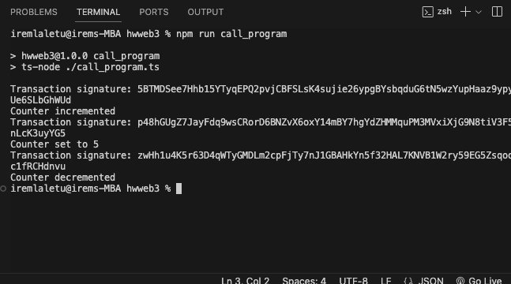

### Solana WEB3 - Homework

- I learned how to save wallet address's secret key in integer array format inside the Wallet.json file.
- and how to call and interact with the functions of an existing smart contract on Solana.

---

